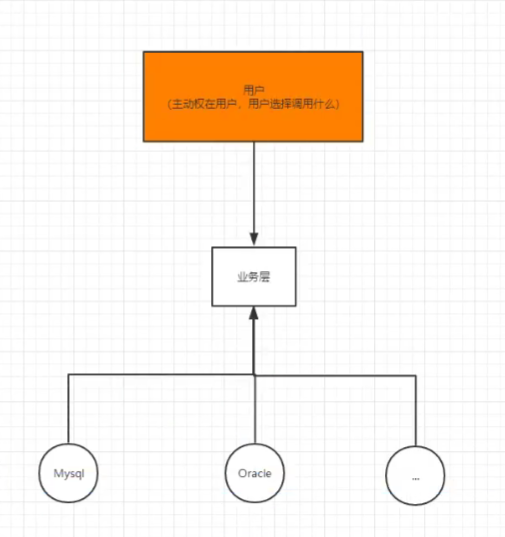

# Spring

## 1、Spring简介

Spring是一个**轻量**级的**非入侵式**的**控制反转(IoC)**和**面向切面(AOP)**的**支持事务的处理**的**容器框架**。

- 官网文档：https://docs.spring.io/spring-framework/docs/current/reference/html/core.html
- 官网：https://spring.io/projects/spring-framework#overview
- 官方下载地址：https://repo.spring.io/list/libs-release-local/org/springframework/spring/5.3.5/
- GitHub源码地址：https://github.com/spring-projects/spring-framework.git

- Maven依赖：

```xml
<!-- https://mvnrepository.com/artifact/org.springframework/spring-webmvc -->
<dependency>
    <groupId>org.springframework</groupId>
    <artifactId>spring-webmvc</artifactId>
    <version>5.3.5</version>
</dependency>
<!-- https://mvnrepository.com/artifact/org.springframework/spring-jdbc -->
<dependency>
    <groupId>org.springframework</groupId>
    <artifactId>spring-jdbc</artifactId>
    <version>5.3.5</version>
</dependency>

```

## 2、Spring组成及拓展

### 2.1、组成


### 2.2、拓展

#### 2.2.1 现代基于Spring的Java开发

构建——协调——连接


#### 2.2.2 Spring Boot

- 一个快速开发的脚手架。
- 可以快速开发单个微服务。
- 约定大于配置。

#### 2.2.3 Spring Cloud

- 基于Spring Boot实现的。

## 3、IOC理论

###  3.1、IOC原型

- UserDao接口
- UserDaoImpl实现类
- UserService业务接口
- UserServiceImpl业务实现类

在我们之前的业务中，用户的需求可能会影响我们原来的代码（每次变动都需要修改大量代码），在代码量较大的情况下修改一次的成本很大，耦合性太高。

我们使用了一个set接口实现：

```java
public class UserServiceImpl implements UserService{
    private UserDao userDao;

    //利用set进行动态实现值的注入
    public void setUserDao(UserDao userDao) {
        this.userDao = userDao;
    }
    @Override
    public void getUser() {
        userDao.getUser();
    }
}
```

- 之前：程序为主动创建对象，控制权在程序员手上。
- 使用了set注入后，程序不再具有主动性，而是变成了被动的接收对象。

```java
public class MyTest {
    public static void main(String[] args) {
        UserServiceImpl userService = new UserServiceImpl();
        //被动的接收UserDaoMysqlImpl对象
        userService.setUserDao(new UserDaoMysqlImpl());
        userService.getUser();
    }
}
```

这种思想，从本质上使得程序员不再去管理对象的创建了，系统的耦合性大大降低，可以更加专注于业务的实现上。

这是IOC的原型。

### 3.2、IOC本质

在IOC之前，主动权在程序员，程序控制调用什么。


IOC：主动权在用户手中，用户选择调用什么。



**IOC是一种设计思想，它是一种通过描述（XML或注解）并通过第三方去生产或获取特定对象的方式，而DI（依赖注入）是其在Spring中的实现方式。**


Spring容器在初始化时先读取配置文件，根据配置文件或元数据创建与组织对象存入容器中，程序使用时再从IOC容器中取出需要的对象。


##  4、HelloSpring

### 4.1、实体类

```java
public class Hello {
    private String str;

    public void setStr(String str) {
        this.str = str;
    }

    public String getStr() {
        return str;
    }

    @Override
    public String toString() {
        return "Hello{" +
                "str='" + str + '\'' +
                '}';
    }

    public void show(){
        System.out.println("Hello " + str);
    }
}
```

### 4.2、XML配置文件

- 在Spring中创建对象并设置属性。

```xml
<?xml version="1.0" encoding="UTF-8"?>
<beans xmlns="http://www.springframework.org/schema/beans"
       xmlns:xsi="http://www.w3.org/2001/XMLSchema-instance"
       xsi:schemaLocation="http://www.springframework.org/schema/beans
        https://www.springframework.org/schema/beans/spring-beans.xsd">
<!--    使用Spring来创建对象，在Spring中，这些都称为Bean
        beans = 对象的容器
        Hello hello = new Hello();
        bean = 对象   new Hello();
        id = hello（变量名）
        class = new 的对象
        property 相当于给对象中的属性设置一个值，利用的是set方法
        -->
    <bean id="hello" class="com.gemini.pojo.Hello">
<!--        ref:引用Spring容器中创建好的对象-->
<!--        value：具体的值，基本数据类型和String类型-->
        <property name="str" value="hello"/>
        <!-- collaborators and configuration for this bean go here -->
    </bean>


    <!-- more bean definitions go here -->

</beans>
```

### 4.3、测试类

```java
    @Test
    public void test() {
//        获取Spring的上下文对象
        ApplicationContext context = new ClassPathXmlApplicationContext("helloBeans.xml");
//        对象现在都在Spring容器中，如果要使用，直接去容器中取出来即可
        Hello hello = (Hello) context.getBean("hello");
        hello.show();
```

### 4.4、输出

```xml
Hello hello
```

### 4.5、总结

要实现不同的操作，只需要在XML配置文件中进行修改，所谓的IOC即为：**对象由Spring来创建，管理和分配。**

## 5、IOC创建对象的方式

1. 使用无参构造方法创建对象，默认实现。

2. 假设要使用有参构造，有以下三种方法，推荐第三种。

   1. 下标赋值

      ```xml
      <!--        有参构造创建对象方式一：下标赋值-->
          <bean id="user" class="com.gemini.pojo.User">
              <constructor-arg index="0" value="Gemini"/>
          </bean>
      ```

   2. 类型赋值（不建议使用）

      ```xml
      <!--    有参构造创建对象方式二：类型赋值(不建议使用）-->
      <bean id="user" class="com.gemini.pojo.User">
          <constructor-arg type="java.lang.String" value="Gemini"/>
      </bean>
      ```

   3. 参数名赋值

      ```xml
      <!--    有参构造创建对象方式三：通过参数名赋值-->
      <bean id="user" class="com.gemini.pojo.User">
          <constructor-arg name="name" value="Gemini"/>
      </bean>
      ```

   ### 总结

   **在配置文件加载的时候，容器中的对象就已经初始化了。**

   **容器中的对象默认为单例实现。**

## 6、Spring配置

### 6.1、别名

```xml
<!--    别名：可以使用别名获取到该对象-->
    <alias name="user" alias="user2"/>
```

### 6.2、Bean的配置

- id:bean的唯一标识符，也就是相当于对象名
- class:bean对象所对应的全限定名
- name:也是别名，而且name可以同时取多个别名，且可通过逗号/空格/分号等分割。

```xml
<bean id="user" class="com.gemini.pojo.User" name="user3,user4,user5">
    <constructor-arg name="name" value="Gemini"/>
</bean>
```

### 6.3、Import  

一般用于团队开发使用，可以将多个配置文件导入合并为一个。

当项目中有多人开发时，不同的人在不同的类上开发，不同的类注册的xml的文件不尽相同，我们可以利用import将所有人的beans.xml合并为一个总的xml，使用的时候直接使用总的配置即可。

applicationContext.xml:

```xml
<?xml version="1.0" encoding="UTF-8"?>
<beans xmlns="http://www.springframework.org/schema/beans"
       xmlns:xsi="http://www.w3.org/2001/XMLSchema-instance"
       xsi:schemaLocation="http://www.springframework.org/schema/beans
        https://www.springframework.org/schema/beans/spring-beans.xsd">
    <import resource="helloBeans.xml"/>
    <import resource="helloBeans2.xml"/>
    <import resource="helloBeans3.xml"/>

</beans>
```

## 7、依赖注入（DI）

### 7.1、构造器注入

前面已经提过。

### 7.2、set方式注入【重点】

- 依赖注入：Set注入。
  - 依赖：bean对象的创建依赖于容器
  - 注入：bean对象的所有属性由容器来注入

#### 7.2.1 环境搭建

实体类：

```java
public class Address {
    private String address;

    public void setAddress(String address) {
        this.address = address;
    }

    public String getAddress() {
        return address;
    }
}
public class Student {
    private String name;
    private Address address;
    private String[] books;
    private List<String> hobbies;
    private Map<String,String> card;
    private Set<String> games;
    private String wife;
    private Properties info;

    public String getName() {
        return name;
    }

    public void setName(String name) {
        this.name = name;
    }

    public Address getAddress() {
        return address;
    }

    public void setAddress(Address address) {
        this.address = address;
    }

    public String[] getBooks() {
        return books;
    }

    public void setBooks(String[] books) {
        this.books = books;
    }

    public List<String> getHobbies() {
        return hobbies;
    }

    public void setHobbies(List<String> hobbies) {
        this.hobbies = hobbies;
    }

    public Map<String, String> getCard() {
        return card;
    }

    public void setCard(Map<String, String> card) {
        this.card = card;
    }

    public Set<String> getGames() {
        return games;
    }

    public void setGames(Set<String> games) {
        this.games = games;
    }

    public String getWife() {
        return wife;
    }

    public void setWife(String wife) {
        this.wife = wife;
    }

    public Properties getInfo() {
        return info;
    }

    public void setInfo(Properties info) {
        this.info = info;
    }

    @Override
    public String toString() {
        return "Student{" +
                "name='" + name + '\'' +
                ", address=" + address +
                ", books=" + Arrays.toString(books) +
                ", hobbies=" + hobbies +
                ", card=" + card +
                ", games=" + games +
                ", wife='" + wife + '\'' +
                ", info=" + info +
                '}';
    }
}
```

#### 7.2.2 普通值注入

```xml
<bean id="student" class="com.gemini.pojo.Student">
    <property name="name" value="Gemini"/>
</bean>
```

#### 7.2.3 Bean注入(ref)

```xml
<bean id="student" class="com.gemini.pojo.Student">
    <property name="address" ref="address"/>
</bean>
<bean id="address" class="com.gemini.pojo.Address"/>
```

#### 7.2.4 数组注入

```xml
<bean id="student" class="com.gemini.pojo.Student">
    <property name="books">
        <array>
            <value>GK</value>
            <value>AG</value>
            <value>ES</value>
        </array>
    </property>
</bean>
```

#### 7.2.5 List,Map,Set注入

```xml
<bean id="student" class="com.gemini.pojo.Student">
    <property name="hobbies">
        <list>
            <value>Steam</value>
            <value>WeGame</value>
            <value>UbiSoft</value>
        </list>
    </property>
    <property name="card">
            <map>
                <entry key="1998" value="Year"/>
                <entry key="1106" value="Day"/>
            </map>
        </property>
        <property name="games">
            <set>
                <value>CSGO</value>
            </set>
        </property>
</bean>
```

#### 7.2.6 空值和Null注入

```xml
<bean id="student" class="com.gemini.pojo.Student">
    <property name="wife" value=""/>
    <property name="wife">
            <null/>
        </property>
</bean>
```

#### 7.2.7 Properties注入

```xml
<bean id="student" class="com.gemini.pojo.Student">
    <property name="info">
        <props>
            <prop key="driver">2020110275</prop>
            <prop key="url">男</prop>
            <prop key="username">root</prop>
            <prop key="password">root</prop>
        </props>
    </property>
</bean>
```

#### 7.2.8 测试类

```java
public class MyTest {
    @Test
    public void test(){
        ApplicationContext context = new ClassPathXmlApplicationContext("beans.xml");
        Student student = (Student) context.getBean("student");
        System.out.println(student);
    }
}
```

#### 7.2.9 测试通过结果

```xml
Student{name='Gemini', address=com.gemini.pojo.Address@34bde49d, books=[GK, AG, ES], hobbies=[Steam, WeGame, UbiSoft], card={1998=Year, 1106=Day}, games=[CSGO], wife='null', info={password=root, driver=2020110275, url=男, username=root}}
```

### 7.3、拓展方式注入

#### 7.3.1、p命令空间注入

- 需要无参构造器
- 可以直接注入属性的值：properties

```xml
<?xml version="1.0" encoding="UTF-8"?>
<beans xmlns="http://www.springframework.org/schema/beans"
       xmlns:xsi="http://www.w3.org/2001/XMLSchema-instance"
       xmlns:p="http://www.springframework.org/schema/p"
       xsi:schemaLocation="http://www.springframework.org/schema/beans
        https://www.springframework.org/schema/beans/spring-beans.xsd">
    <!--    p命令空间注入，可以直接注入属性的值：properties-->
    <bean id="address" class="com.gemini.pojo.Address" p:address="Shandong"/>
</beans>
```

```java
@Test
public void test1(){
    ApplicationContext context = new ClassPathXmlApplicationContext("beans.xml");
    Address address = context.getBean("address", Address.class);
    System.out.println(address);
}
```

输出为：

```ba
Address{address='Shandong'}
```

#### 7.3.2、c命令空间注入

- 需要有参构造器
- 通过构造器注入：constructor-args

```xml
<?xml version="1.0" encoding="UTF-8"?>
<beans xmlns="http://www.springframework.org/schema/beans"
       xmlns:xsi="http://www.w3.org/2001/XMLSchema-instance"
       xmlns:c="http://www.springframework.org/schema/c"
       xsi:schemaLocation="http://www.springframework.org/schema/beans
        https://www.springframework.org/schema/beans/spring-beans.xsd">
    <bean id="address1" class="com.gemini.pojo.Address" c:address="Beijing"/>
</beans>
```

- 注意点：需要导入xml约束才能使用p和c命名空间。

```xml
xmlns:c="http://www.springframework.org/schema/c"
xmlns:p="http://www.springframework.org/schema/p"
```

### 7.4、Beand的作用域


#### 7.4.1 Singleton（default）


#### 7.4.2 Prototype


其设置方式为：

```xml
<bean id="accountService" class="com.something.DefaultAccountService" scope="prototype"/>
```

#### 7.4.3 request、session、application等其他作用域

- 在web开发中使用。

## 8、Bean的自动装配

- 自动装配：Spring在上下文中自动寻找，并自动给bean装配属性。
- 在Spring中有三种装配的方式：
  - 在xml中显式配置
  - 在java配置类中显式配置
  - **隐式的自动装配bean**

### 8.1、环境搭建

- **一个人有两个宠物的场景**

```java
public class Cat {
    public void shout(){
        System.out.println("miao~~");
    }
}
public class Dog {
    public void shout(){
        System.out.println("wang!~");
    }
}
public class Human {
    private Dog dog;
    private Cat cat;
    private String name;

    public Dog getDog() {
        return dog;
    }

    public void setDog(Dog dog) {
        this.dog = dog;
    }

    public Cat getCat() {
        return cat;
    }

    public void setCat(Cat cat) {
        this.cat = cat;
    }

    public String getName() {
        return name;
    }

    public void setName(String name) {
        this.name = name;
    }

    @Override
    public String toString() {
        return "Human{" +
                "dog=" + dog +
                ", cat=" + cat +
                ", name='" + name + '\'' +
                '}';
    }
}
```

### 8.2、ByName自动装配

- ByName:会自动在容器上下文中查找和自己的对象类型**属性名称对应**的bean。
- 需要保证所有bean的id唯一，即不能出现两个bean有相同id的情况。

```xml
<bean id="dog" class="com.gemini.pojo.Dog"/>
<bean id="cat" class="com.gemini.pojo.Cat"/>
<bean id="human" class="com.gemini.pojo.Human" autowire="byName">
    <property name="name" value="Gemini"/>
</bean>
```

### 8.3、ByType自动装配

- ByType:会自动在容器上下文中查找和自己的对象类型**属性类型对应**的bean。
- 需要保证所有bean的class唯一，即不能出现两个bean有相同class的情况。

```xml
<bean id="dog" class="com.gemini.pojo.Dog"/>
<bean id="cat" class="com.gemini.pojo.Cat"/>
<bean id="human" class="com.gemini.pojo.Human" autowire="byType">
    <property name="name" value="Gemini"/>
</bean>
```

### 8.3、使用注解实现自动装配

要使用注解须知：

1. 导入约束(context约束)
2. 配置注解的支持

```xml
<?xml version="1.0" encoding="UTF-8"?>
<beans xmlns="http://www.springframework.org/schema/beans"
    xmlns:xsi="http://www.w3.org/2001/XMLSchema-instance"
    xmlns:context="http://www.springframework.org/schema/context"
    xsi:schemaLocation="http://www.springframework.org/schema/beans
        https://www.springframework.org/schema/beans/spring-beans.xsd
        http://www.springframework.org/schema/context
        https://www.springframework.org/schema/context/spring-context.xsd">

    <context:annotation-config/>

</beans>
```

#### 8.3.1 @AutoWired

- 直接在属性上使用即可，且添加该注解后，可以去掉该属性的setter方法。
- 默认按照ByType进行装配。


```java
@Target({ElementType.CONSTRUCTOR, ElementType.METHOD, ElementType.PARAMETER, ElementType.FIELD, ElementType.ANNOTATION_TYPE})
@Retention(RetentionPolicy.RUNTIME)
@Documented
public @interface Autowired {

	/**
	 * Declares whether the annotated dependency is required.
	 * <p>Defaults to {@code true}.
	 */
	boolean required() default true;

}
```

#### 8.3.2 @Resource

- 默认通过ByName实现，若找不到名字，则通过ByType实现。

```java
public class Human {
    @Autowired
    private Dog dog;
    @Resource
    private Cat cat;
}
```

## 9、使用注解开发

使用注解开发必须保证AOP的包导入。


此外，如上所述，还需导入context约束，增加注解支持。

最后，开启注解扫描，指定要扫描的包，这个包下的注解才会生效。

```xml
<?xml version="1.0" encoding="UTF-8"?>
<beans xmlns="http://www.springframework.org/schema/beans"
       xmlns:xsi="http://www.w3.org/2001/XMLSchema-instance"
       xmlns:context="http://www.springframework.org/schema/context"
       xsi:schemaLocation="http://www.springframework.org/schema/beans
        https://www.springframework.org/schema/beans/spring-beans.xsd
        http://www.springframework.org/schema/context
        https://www.springframework.org/schema/context/spring-context.xsd">
<!--    指定要扫描的包，这个包下的注解就会生效-->
    <context:component-scan base-package="com.gemini.pojo"/>
    <context:annotation-config/>

</beans>
```


### 9.1、 bean

**@Component**

```java
//@Component <=> <bean id="user" class="com.gemini.pojo.USer"/>
@Component
public class User {
    public String name = "GEMINI";
}
```

### 9.2、属性注入 

**@Value**

```java
@Component
public class User {
    @Value("Gemini")
    public String name;
}
```

或者注入在setter方法上面：

```java
@Component
public class User {

    public String name;
    @Value("Gemini")
    public void setName(String name) {
        this.name = name;
    }
}
```

### 9.3、衍生的注解

在web开发中，会按照MVC三层架构分层。

- dao：【**@Repository**】
- service：【**@Service**】
- controller：【**@Controller**】

以上三个注解功能与@Component注解功能都是一样的，都是代表装配bean到Spring容器中。

### 9.4、自动装配注解

在8.3节中已经介绍过。

### 9.5、作用域注解

**@Scope**

```java
@Component
@Scope("prototype")
//@Scope("singleton")
public class User {

    public String name;
    @Value("Gemini")
    public void setName(String name) {
        this.name = name;
    }
}
```

## 10、Java配置类

### 10.1 实体类

```java
@Component
public class Dog {
    @Value("Dog Mi")
    private String name;

    public String getName() {
        return name;
    }

    public void setName(String name) {
        this.name = name;
    }

    @Override
    public String toString() {
        return "Dog{" +
                "name='" + name + '\'' +
                '}';
    }
}
```

### 10.2 配置类

- 方式一：@ComponentScan("com.gemini.pojo")开启包组件扫描，然后在实体类上添加@Component注解，实现bean的注入，bean的id默认为实体类名的小写dog。
- 方式二：写一个方法，在方法上添加@Bean注解,其中方法名相当于bean的id，返回值相当于bean的class。
- @Import 注解：导入其他配置类
- 如果方式一和二一起使用，则会在Spring容器中生成两个对象。

```java
//代表这是一个配置类
@Configuration
//@ComponentScan("com.gemini.pojo")
@Import(MyConfig2.class)
public class MyConfig {
//    方法名相当于bean的id，返回值相当于bean的class
    @Bean
    public Dog getDog(){
        return new Dog();
    }
}
```

### 10.3 测试类

```java
@Test
    public void test1(){
        ApplicationContext context = new AnnotationConfigApplicationContext(MyConfig.class);
        Dog dog = context.getBean("dog", Dog.class);
        Dog getDog = context.getBean("getDog", Dog.class);
        System.out.println(dog.hashCode());
        System.out.println(getDog.hashCode());
        System.out.println(dog == getDog);
    }
}
```

结果：

```ba
1934932165
551016187
false
```

### 10.4 小结

- **完全不使用Spring的xml配置。**
- 这种纯Java的配置方式，在SpringBoot中广泛使用。

## 11、AOP

### 11.1、代理模式

**代理模式：SpringAOP的底层。**

- 关于代理模式可参见：[Guide的代理模式详解](https://github.com/Snailclimb/JavaGuide/blob/master/docs/java/basis/%E4%BB%A3%E7%90%86%E6%A8%A1%E5%BC%8F%E8%AF%A6%E8%A7%A3.md)
- 关于面向对象七大原则可参见：[设计模式之面向对象七大基本原则](https://blog.csdn.net/yanbober/article/details/45312243)
- 通过代理实现业务的修改：


### 11.2、AOP

AOP，意为：[面向切面编程](https://baike.baidu.com/item/面向切面编程/6016335)，通过[预编译](https://baike.baidu.com/item/预编译/3191547)方式和运行期间动态代理实现程序功能的统一维护的一种技术。AOP是[OOP](https://baike.baidu.com/item/OOP)的延续，是软件开发中的一个热点，也是[Spring](https://baike.baidu.com/item/Spring)框架中的一个重要内容，是[函数式编程](https://baike.baidu.com/item/函数式编程/4035031)的一种衍生范型。


### 11.3 Spring 实现AOP

【重要】需要使用AOP织入，导入一个依赖包。

```xm
<!-- https://mvnrepository.com/artifact/org.aspectj/aspectjweaver -->
<dependency>
    <groupId>org.aspectj</groupId>
    <artifactId>aspectjweaver</artifactId>
    <version>1.9.6</version>
</dependency>
```

#### 11.3.1 方式一：使用Spring的API接口

Service层代码：

```java
public interface UserService {
    void add();
    void delete();
    void update();
    void query();
}
public class UserServiceImpl implements UserService{
    @Override
    public void add() {
        System.out.println("add");
    }

    @Override
    public void delete() {
        System.out.println("delete");
    }

    @Override
    public void update() {
        System.out.println("update");
    }

    @Override
    public void query() {
        System.out.println("query");
    }
}
```

添加环绕（前后各添加）日志的代码：

```java
public class Log implements MethodBeforeAdvice {
//    method：要执行的目标对象的方法
//    objects：参数
//    o：目标对象
    @Override
    public void before(Method method, Object[] objects, Object o) throws Throwable {
        System.out.println(o.getClass().getName() + "'s " + method.getName() + " was executed.");
    }
}
public class AfterLog implements AfterReturningAdvice {
    @Override
    public void afterReturning(Object o, Method method, Object[] objects, Object o1) throws Throwable {
        System.out.println("执行了" + method.getName() + "方法，返回结果为" + o);
    }
}
```

xml配置文件：

```xml
<?xml version="1.0" encoding="UTF-8"?>
<beans xmlns="http://www.springframework.org/schema/beans"
       xmlns:xsi="http://www.w3.org/2001/XMLSchema-instance"
       xmlns:aop="http://www.springframework.org/schema/aop"
       xsi:schemaLocation="http://www.springframework.org/schema/beans
                           http://www.springframework.org/schema/beans/spring-beans.xsd
                           http://www.springframework.org/schema/aop
                           http://www.springframework.org/schema/aop/spring-aop.xsd">
    <bean id="userService" class="com.gemini.service.UserServiceImpl"/>
    <bean id="log" class="com.gemini.log.Log"/>
    <bean id="afterLog" class="com.gemini.log.AfterLog"/>
<!--    配置AOP：需要导入AOP的约束-->
    <aop:config>
    <!--切入点:pointcut    表达式：expression  execution(修饰词 返回值 类名 方法名 参数)-->
        <aop:pointcut id="pointcut" expression="execution(* com.gemini.service.UserServiceImpl.*(..))"/>
<!--        执行环绕增加-->
        <aop:advisor advice-ref="log" pointcut-ref="pointcut"/>
        <aop:advisor advice-ref="afterLog" pointcut-ref="pointcut"/>
    </aop:config>

</beans>
```

测试类：

```java
public class MyTest {
    @Test
    public void test(){
        ApplicationContext context = new ClassPathXmlApplicationContext("applicationContext.xml");
//        动态代理代理的是接口
        UserService userService = (UserService) context.getBean("userService");
        userService.add();
    }
}
```

测试结果：

```bas
com.gemini.service.UserServiceImpl's add was executed.
add
执行了add方法，返回结果为null
```

#### 11.3.2 方式二：自定义切面【推荐】

添加环绕（前后各添加）日志的代码：

```java
public class Diy {
    public void before(){
        System.out.println("=========方法执行前=======");
    }
    public void after(){
        System.out.println("=========方法执行后=======");
    }
}
```

xml配置文件：

```xml
    <bean class="com.gemini.diy.Diy" id="diy"/>
    <aop:config>
<!--        自定义的切面，即一个类 ref：要引用的类-->
        <aop:aspect ref="diy">
<!--            切入点-->
            <aop:pointcut id="pointcut" expression="execution(* com.gemini.service.UserServiceImpl.*(..))"/>
<!--            通知-->
            <aop:before method="before" pointcut-ref="pointcut"/>
            <aop:after method="after" pointcut-ref="pointcut"/>
        </aop:aspect>
    </aop:config>
```

测试输出结果：

```bas
=========方法执行前=======
add
=========方法执行后=======
```

#### 11.3.3 切入点表达式

- 切入点表达式的作用：知道对某个类的某个方法进行增强

- 语法结构：

  **execution([权限修饰符] [返回类型] [类全路径] [方法名称] ([参数列表]))**

例如：

- 对com.gemini.dao.BookDao类里面的add进行增强

  execution(\* com.gemini.dao.BookDao.add(..))

- 对com.gemini.dao.BookDao类里面的所有方法进行增强

   execution(\* com.gemini.dao.BookDao.\*(..))

- 对com.gemini.dao包内所有类的所有方法进行增强

  execution(\* com.gemini.dao.\*.\*(..))**

#### 11.3.4 AOP相关术语


#### 11.3.5 方式三：注解实现AOP

```java
@Aspect //标注这个类是一个切面
public class AnnotationPointCut {

    @Before("execution(* com.gemini.service.UserServiceImpl.*(..))")
    public void before(){
        System.out.println("=========方法执行前=======");
    }

    @After("execution(* com.gemini.service.UserServiceImpl.*(..))")
    public void after(){
        System.out.println("=========方法执行后=======");
    }

//    在环绕增强中，我们可以给定一个参数，代表我们要获取处理的点：连接点
    @Around("execution(* com.gemini.service.UserServiceImpl.*(..))")
    public void around(ProceedingJoinPoint point) throws Throwable {
        System.out.println("=========环绕前=======");
//        方法执行
        point.proceed();
        System.out.println("=========环绕后=======");
    }
}
```

```xml
<?xml version="1.0" encoding="UTF-8"?>
<beans xmlns="http://www.springframework.org/schema/beans"
       xmlns:xsi="http://www.w3.org/2001/XMLSchema-instance"
       xmlns:aop="http://www.springframework.org/schema/aop"
       xsi:schemaLocation="http://www.springframework.org/schema/beans
                           http://www.springframework.org/schema/beans/spring-beans.xsd
                           http://www.springframework.org/schema/aop
                           http://www.springframework.org/schema/aop/spring-aop.xsd">
    <bean id="userService" class="com.gemini.service.UserServiceImpl"/>
<!--    方式三-->
<!--    注入bean-->
    <bean class="com.gemini.diy.AnnotationPointCut"/>
<!--    开启注解支持      proxy-target-class默认为false，表示默认使用JDK实现动态代理，若为true则表示使用CGLIB-->
    <aop:aspectj-autoproxy proxy-target-class="true"/>

</beans>
```

```java
public class MyTest {
    @Test
    public void test(){
        ApplicationContext context = new ClassPathXmlApplicationContext("applicationContext.xml");
//        动态代理代理的是接口
        UserService userService = (UserService) context.getBean("userService");
        userService.add();
    }
}
```

```bas
=========环绕前=======
=========方法执行前=======
add
=========方法执行后=======
=========环绕后=======
```

## 12、Spring整合Mybatis

步骤：

1. 导入相关jar包。
   1. junit
   2. mybatis
   3. mysql数据库
   4. spring 相关
   5. aop织入
   6. mybatis-spring
2. 编写配置文件
3. 测试

### 12.1、回忆Mybatis

1. 编写实体类
2. 编写核心配置文件
3. 编写接口
4. 编写Mapper.xml
5. 测试

### 12.2、Mybatis-Spring

#### 12.2.1 方式一

1. **编写数据源DataSource配置**

   ```xml
   <!--    DataSource：使用Spring的数据源替代Mybatis的配置：我们这里使用Spring的JDBC-->
   <bean id="dataSource" class="org.springframework.jdbc.datasource.DriverManagerDataSource">
       <property name="driverClassName" value="com.mysql.jdbc.Driver"/>
       <property name="url" value="jdbc:mysql://localhost:3306/mybatis?useSSL=true&amp;useUnicode=true&amp;characterEncoding=UTF-8&amp;serverTimezone=UTC"/>
       <property name="username" value="root"/>
       <property name="password" value="root"/>
   </bean>
   ```

2. **创建sqlSessionFactory**

   在基础的 MyBatis 用法中，是通过 `SqlSessionFactoryBuilder` 来创建 `SqlSessionFactory` 的。而在 MyBatis-Spring 中，则使用 `SqlSessionFactoryBean` 来创建。

   ```xml
   <!--    sqlSessionFactory-->
       <bean id="sqlSessionFactory" class="org.mybatis.spring.SqlSessionFactoryBean">
           <property name="dataSource" ref="dataSource" />
   <!--        绑定Mybatis配置文件,还可以进行Mapper注册和其他配置（如别名）-->
           <property name="configLocation" value="mybatis-config.xml"/>
           <property name="mapperLocations" value="UserMapper.xml"/>
           <property name="typeAliases" value="com.gemini.pojo.User"/>
       </bean>
   ```

3. **使用sqlSessionTemplate**

   `SqlSessionTemplate` 是 MyBatis-Spring 的核心。作为 `SqlSession` 的一个实现，这意味着可以使用它无缝代替你代码中已经在使用的 `SqlSession`。 `SqlSessionTemplate` 是线程安全的，可以被多个 DAO 或映射器所共享使用。

   ```xml
   <!--SqlSessionTemplate：就是我们使用的sqlSession    -->
   <bean class="org.mybatis.spring.SqlSessionTemplate" id="sqlSessionTemplate">
       <!--该SqlSessionTemplate类中没有set方法，因此只能使用构造器注入-->
       <constructor-arg name="sqlSessionFactory" ref="sqlSessionFactory"/>
   </bean>
   ```

4. **需要给接口加实现类**

   ```java
   public class UserMapperImpl implements UserMapper {
   
       //原来我们的所有操作都使用SQLSession来执行，现在使用SqlSessionTemplate
       private SqlSessionTemplate sqlSessionTemplate;
       public void setSqlSessionTemplate(SqlSessionTemplate sqlSessionTemplate) {
           this.sqlSessionTemplate = sqlSessionTemplate;
       }
       @Override
       public List<User> selectUser() {
           UserMapper mapper = sqlSessionTemplate.getMapper(UserMapper.class);
           return mapper.selectUser();
       }
   }
   ```

5. **实现类注入到Spring**中，测试使用。

   ```xml
   <!--    注入实现类，注入sqlSessionTemplate属性-->
   <bean class="com.gemini.mapper.UserMapperImpl" id="userMapper">
       <property name="sqlSessionTemplate" ref="sqlSessionTemplate"/>
   </bean>
   ```

6. 测试

   ```java
   @Test
   public void test1(){
       ApplicationContext context = new ClassPathXmlApplicationContext("applicationContext.xml");
       UserMapper userMapper = context.getBean("userMapper", UserMapper.class);
       for (User user : userMapper.selectUser()) {
           System.out.println(user);
       }
   }
   ```

   测试结果：

   ```bash
   User(id=1, name=Gemini, pwd=36252)
   User(id=2, name=Xio, pwd=123456)
   User(id=3, name=张笑, pwd=123456)
   User(id=4, name=gemini, pwd=123456)
   User(id=5, name=GodMi, pwd=793400)
   ```

   

#### 12.2.2 方式二

`SqlSessionDaoSupport` 是一个抽象的支持类，用来为你提供 `SqlSession`。调用 `getSqlSession()` 方法你会得到一个 `SqlSessionTemplate`，从而相比方式一省去了sqlSessionTemplate的配置部分，之后可以用于执行 SQL 方法。

```java
public class UserMapperImpl2 extends SqlSessionDaoSupport implements UserMapper{
    @Override
    public List<User> selectUser() {
        return getSqlSession().getMapper(UserMapper.class).selectUser();
    }
}
```

```xml
    <bean class="com.gemini.mapper.UserMapperImpl2" id="userMapper2">
<!--        父类的属性-->
        <property name="sqlSessionFactory" ref="sqlSessionFactory"/>
    </bean>
```

## 13、事务

